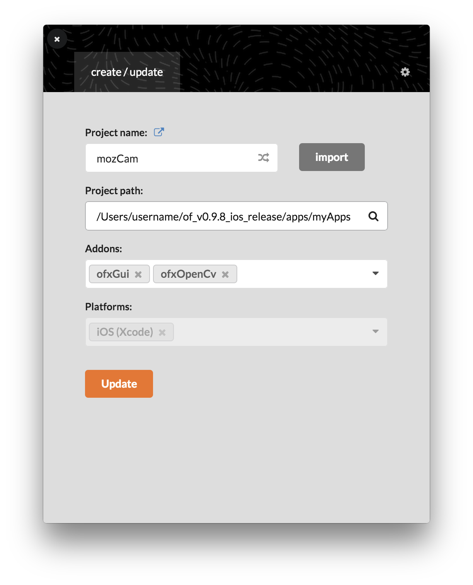

# mozCam
openFrameworksを使ったiOSアプリサンプルです。

## 内容
カメラより映像を取得し、OpenCVで顔認識処理を行い、認識された顔に対してモザイクをかけます。
撮影ボタンを押すとカメラロールに画像を保存します。

## 実行環境
openFrameworks (ios) 0.9.8

## 実行方法
1.ソース全体をフォルダごとSDK内のapps/myAppsフォルダに設置する
```
of_v0.9.8_ios_release/apps/myApps
```

2.ProjectGeneratorを起動してProjectファイルをimportし、addonにofxGuiとofxOpenCv.hを追加しupdateする


